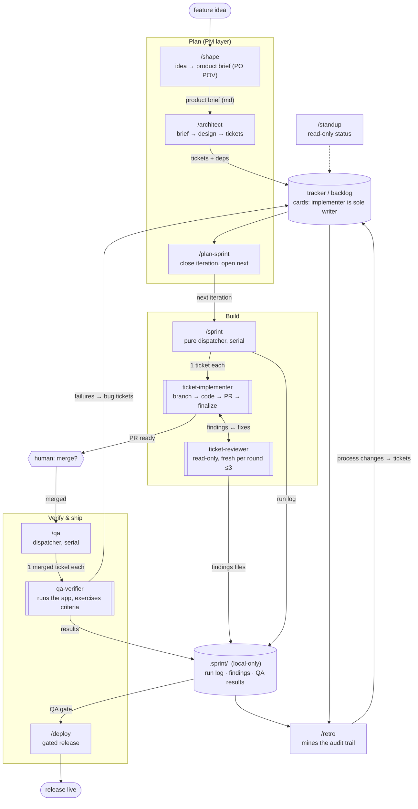

# Dev-workflow suite

Eleven Claude Code skills (this repo) plus three subagents
([kyimoemin/agents](https://github.com/kyimoemin/agents)) that together run a
full software lifecycle: idea → product brief → design → tickets → sprint →
QA → release → retro. Every skill discovers the project's tracker and conventions at
runtime, so there are no per-repo variants. Two rules hold everywhere:
**nothing consequential happens without an explicit go-ahead** (filing,
merging, deploying), and **nothing lives only in the conversation** — durable
state is the tracker plus `.sprint/` files.

## The loop

Solid arrows are data handoffs; dashed are read-only reads. Double-bordered
nodes are subagents — everything else is a skill you invoke.

## Who does what

| Layer | Skill / agent | In one line |
|---|---|---|
| Plan | `/shape` | Feature idea → product brief from the PO's seat: users, implied scope, MVP line — no code, no tickets |
| Plan | `/architect` | Product brief (or raw idea) → decision-dense design (+ mermaid when structure warrants) → PR-sized tickets |
| Plan | `/plan-sprint` | Close the finished iteration, open the next from ready backlog tickets |
| Build | `/sprint` | Dispatch one `ticket-implementer` per ticket; park blockers; merge only what you name |
| Build | `ticket-implementer` | One ticket end to end: branch, code, PR, own review loop, finalize; never merges |
| Build | `ticket-reviewer` | Read-only diff review vs bugs/security/criteria; one parseable return line |
| Ship | `/qa` | One `qa-verifier` per merged ticket; failures become bug tickets on go-ahead |
| Ship | `qa-verifier` | Proves shipped behavior in the running app; code reading doesn't count |
| Ship | `/deploy` | Discover the release mechanism; CI + QA gates; ship on explicit go-ahead; verify live |
| Learn | `/retro` | Turn run logs, findings, and QA results into 1–3 evidenced process changes |
| Anytime | `/standup` | Read-only: where things stand, grouped by who can act, ends with a `/sprint` line |
| Anytime | `/add-ticket` `/start-ticket` `/close-ticket` | One-off capture / interactive single ticket / land a PR outside a sprint run |

## The handshakes that hold it together

- **Tracker cards** are the durable truth of each ticket. Single-writer
  rule: the implementer owns its card; dispatchers read, never move or
  comment. Cards carry a trail line per event so a dead session stays
  diagnosable.
- **`.sprint/`** (kept out of git via `.git/info/exclude`, never
  `.gitignore`) is the audit trail: append-only run logs, per-round
  findings files, QA results. `/deploy` reads it as the QA gate; `/retro`
  is its final consumer. It's local-only — QA gates and retros only work on
  the machine the sprint ran on.
- **The product brief** (md file written by /shape) is the durable product
  contract: /architect reads it as settled scope and inherits its
  out-of-scope list, so product decisions are made once, in one place.
- **Dependency links on tickets** (labels, "depends on #N", tracker links)
  are written by architect and read by standup, plan-sprint, and
  sprint's ordering.
- **Humans stay in the loop at exactly three points:** answering blocked
  tickets' questions, merging PRs, and the deploy go-ahead. Everything else
  is dispatchable.
