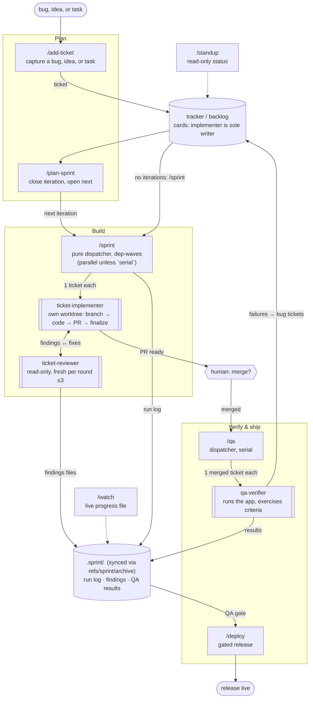

# Dev-workflow suite

Seven Claude Code skills (this repo) plus three subagents
([kyimoemin/agents](https://github.com/kyimoemin/agents)) that together run
the delivery half of a software lifecycle: tickets → sprint → QA → release.
Every skill discovers the project's tracker and conventions at runtime, so
there are no per-repo variants. Two rules hold everywhere: **nothing
consequential happens without an explicit go-ahead** (filing, merging,
deploying), and **nothing lives only in the conversation** — durable state is
the tracker plus `.sprint/` files.

## The loop

```mermaid
flowchart TB
    subgraph pm ["Plan"]
        addticket["/add-ticket\ncapture a bug, idea, or task"]
        plansprint["/plan-sprint\nclose iteration, open next"]
    end

    subgraph build ["Build"]
        sprint["/sprint\npure dispatcher, dep-waves\n(parallel unless `serial`)"]
        impl[["ticket-implementer\nown worktree: branch → code → PR → finalize"]]
        reviewer[["ticket-reviewer\nread-only, fresh per round ≤3"]]
    end

    subgraph ship ["Verify & ship"]
        qa["/qa\ndispatcher, serial"]
        qav[["qa-verifier\nruns the app, exercises criteria"]]
        deploy["/deploy\ngated release"]
    end

    standup["/standup\nread-only status"]
    watch["/watch\nlive progress file"]

    tracker[("tracker / backlog\ncards: implementer is sole writer")]
    dotsprint[(".sprint/  (synced via refs/sprint/archive)\nrun log · findings · QA results")]

    idea([bug, idea, or task]) --> addticket
    addticket -- "ticket" --> tracker
    tracker --> plansprint
    plansprint -- "next iteration" --> sprint
    tracker -- "no iterations: /sprint <ids>" --> sprint
    sprint -- "1 ticket each" --> impl
    impl <-- "findings ↔ fixes" --> reviewer
    reviewer -- "findings files" --> dotsprint
    sprint -- "run log" --> dotsprint
    impl -- "PR ready" --> merge{{"human: merge?"}}
    merge -- "merged" --> qa
    qa -- "1 merged ticket each" --> qav
    qav -- "results" --> dotsprint
    qav -- "failures → bug tickets" --> tracker
    dotsprint -- "QA gate" --> deploy
    deploy --> live([release live])
    standup -.-> tracker
    watch -.-> dotsprint
```

Solid arrows are data handoffs; dashed are read-only reads. Double-bordered
nodes are subagents — everything else is a skill you invoke.

## Who does what

| Layer | Skill / agent | In one line |
|---|---|---|
| Plan | `/add-ticket` | One-off capture of a bug, idea, or task — discovers the tracker's conventions, checks for duplicates, files on go-ahead |
| Plan | `/plan-sprint` | Close the finished iteration, open the next from ready backlog tickets (default board is sprint-based — tickets must land in a sprint before dispatch) |
| Build | `/sprint` | Dispatch one `ticket-implementer` per ticket in dependency waves — independent tickets run parallel in isolated worktrees, `serial` flag forces one-at-a-time; park blockers; merge only what you name — or `auto`: loop pick-up → implement → merge → file follow-ups (bugs ready, improvements proposed for your triage) until nothing is ready, stopping only for your decisions |
| Build | `ticket-implementer` | One ticket end to end: branch, code + tests, PR, own review loop, finalize; never merges |
| Build | `ticket-reviewer` | Read-only diff review vs bugs/security/criteria/test coverage; one parseable return line |
| Ship | `/qa` | One `qa-verifier` per merged ticket; failures become bug tickets on go-ahead |
| Ship | `qa-verifier` | Proves shipped behavior in the running app; code reading doesn't count |
| Ship | `/deploy` | Discover the release mechanism; CI + QA gates; ship on explicit go-ahead; verify live |
| Anytime | `/standup` | Read-only: where things stand, grouped by who can act, ends with a `/sprint` line |
| Anytime | `/watch` | Writes `.sprint/progress-<sprint-id>.md` for the live run, mirrored to the fixed `.sprint/progress-current.md` — funnel, waiting-on-you list, ticket table, derived read-only from the run's own log; `--watch` keeps it live |

## The handshakes that hold it together

- **Tracker cards** are the durable truth of each ticket. Single-writer
  rule: the implementer owns its card; dispatchers read, never move or
  comment. Cards carry a trail line per event so a dead session stays
  diagnosable.
- **`.sprint/`** (kept out of git via `.git/info/exclude`, never
  `.gitignore`) is the audit trail: append-only run logs, per-round
  findings files, QA results. `/deploy` reads it as the QA gate. It's kept
  off every branch, but not machine-bound: `/sprint` and `/qa` snapshot it
  to the `refs/sprint/archive` ref and push, and readers restore a missing
  `.sprint/` from that ref — so QA gates work on machines the sprint didn't
  run on.
- **`docs/design/ui/design-language.md`**, where a project has one, is a
  repo convention binding every implementer's user-facing work — like the
  tests-follow-the-repo's-lead rule, whether or not a ticket links it.
- **Dependency links on tickets** (labels, "depends on #N", tracker links)
  are read by standup, plan-sprint, and sprint's ordering.
- **Humans stay in the loop at exactly three points once tickets exist:**
  answering blocked tickets' questions, merging PRs, and the deploy
  go-ahead. Everything else is dispatchable. `/sprint auto` can delegate
  the middle one (clean, CI-green merges only); the rest are never
  automated.
