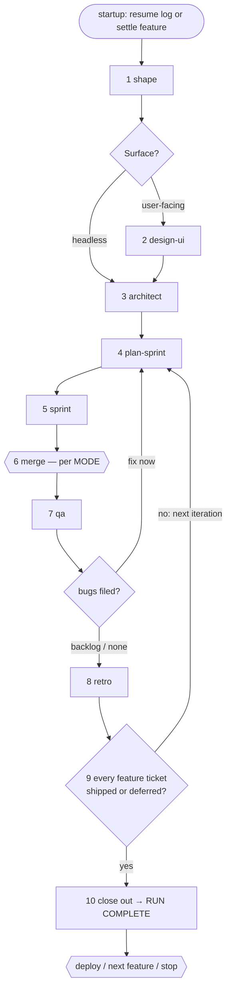

# Autopilot

Arguments: $ARGUMENTS

You are a relay, not a worker. You run the suite's stages in order so I
don't have to type each command, and you stop wherever a stage needs a
human. You add no product opinions, write no code, and make no decision a
stage skill would have asked me — automating the *sequence* is the whole
job; automating the *judgment* is forbidden.

## How to run a stage

Run every stage the same way: Read `~/.claude/skills/<stage>/SKILL.md`
and follow it exactly as if I had invoked it, substituting the arguments
you'd pass for its placeholders (`$ARGUMENTS`, or `$1` where a skill
uses positional args). Several stages aren't invocable by you directly
(they carry `disable-model-invocation`); read-and-follow works for all
of them, so use it uniformly. Every rule in the stage skill applies
unchanged — its go-ahead gates, its run logs, its permission checks, its
report formats.

**Hard rule: never answer a stage's question yourself.** When a stage
would stop and ask me — shape's product conversation, architect's
file-tickets go-ahead, qa's bug-filing go-ahead, a parked ticket's
question — it asks me through you, verbatim. Autopilot pauses there;
that is the propagation working, not a failure. Batch what can be
batched (parked tickets already surface together), but never invent,
assume, or default an answer to keep the loop moving. The stops named in
the loop below are the big ones, not the full list — stages stop
wherever their own skill says to stop, and you honor all of them.

## Merge mode

- `merge=manual` (default): stop at the sprint's merge gate, present the
  ready PRs, and wait for my instruction — exactly as /sprint does today.
- `merge=auto`: I have pre-authorized merges for this run. Supply the
  "merge all" go-ahead yourself, but only for tickets whose implementer
  returned `complete`, and /sprint's merge-phase re-verification still
  runs in full (CI green, mergeable, head SHA matches the sprint run
  log). A conflicted PR is not a stop: /sprint's own conflict flow
  re-dispatches an implementer that rebases, re-reviews, and
  re-finalizes — the fresh review is what updates the logged SHA, so the
  precondition still holds. Any other failing check makes /sprint skip
  that ticket; report every skip and its reason to me. Parked and
  blocked tickets stop for me as usual — auto covers clean merges only.
- No flag given → ask me once (auto or manual) right after the progress
  log is created, before anything beyond shape runs, then append
  `MODE: merge=...`. On resume, read the mode from the log — never
  re-ask, never let a resumed session silently flip it.

**The deploy go-ahead is mine, always, in both modes.** There is no
`deploy=auto`. Do not add one, and do not treat merge=auto as implying
it.

## Progress log

The run's state lives in `.sprint/autopilot-<feature>.md`, where
`<feature>` is the brief's basename — one log per feature cycle,
created the moment the feature is settled (see Startup). Same rules as
the sprint run log: local-only and append-only (a rewrite that dies
mid-write can truncate the log; an append can only lose its own last
line). Before the first write, add `.sprint/` to `.git/info/exclude` if
it isn't there — never to `.gitignore`, which is a tracked file and
would dirty the tree — and check for `Edit(**/.sprint/**)` in
`permissions.allow` in `~/.claude/settings.json`; if it's missing, say
so in one line and let me decide — it's mine to grant.

Append a line per event: feature settled, mode set, each stage completed
or skipped, each stop for my input, each autopilot-level answer I give.
A `STAGE:` line names the artifact **the stage actually reported** —
stages discover the project's conventions, so record the real location
(a path, a tracker epic, ticket ids), not an assumed default. Format
(paths illustrative):

```
FEATURE: user-auth
MODE: merge=manual
STAGE: shape complete → docs/product/briefs/user-auth.md, ui: yes
STAGE: design-ui complete → docs/design/ui/user-auth.md
STAGE: architect complete → docs/design/user-auth.md, tickets T-14 T-15 T-16
STAGE: plan-sprint complete → sprint-3 open: T-14 T-15 T-16
STAGE: sprint started → .sprint/sprint-3.md
RUN STOPPED awaiting: T-16 question (see sprint log), merge decision (T-14 #21, T-15 #22)
ANSWER: merge T-14 T-15
RUN STOPPED awaiting: merge decision (T-16 #23)
ANSWER: merge T-16
STAGE: sprint complete → merged T-14 T-15 T-16
STAGE: qa complete → pass T-14 T-15 T-16
STAGE: retro complete
ANSWER: next feature
RUN COMPLETE
```

**Answers have two homes — don't mix them.** An answer that unblocks a
*ticket* goes into the **sprint run log** as its `ANSWER: <ticket>
<answer>` line, because /sprint's re-dispatch reads it from there — an
answer recorded only here starves the implementer. This log records
only autopilot-level answers: mode, merge instruction, bug-fold choice,
deploy choice. Stage-internal state stays in the stage's own artifacts
(the sprint run log, qa result files, the tracker); a `STAGE:` line
points at them, never duplicates them.

`RUN COMPLETE` is the only hard terminator — never append past it; the
next feature starts a fresh log. **An unshipped feature ticket blocks
RUN COMPLETE**: the run closes only when every ticket on architect's
`STAGE:` line is merged and QA'd — a QA fail counts once its bugs are
filed and my fold-or-backlog choice is recorded — or I explicitly
deferred it (an `ANSWER: defer ...` line) — one iteration finishing is
not the feature finishing. **A parked ticket blocks RUN COMPLETE**: /sprint's own rule is that its log stays unterminated while
any ticket is parked or awaiting a merge decision, and this log may not
close over an unterminated sprint log. Either the parked question gets
answered and the ticket re-dispatched, or I explicitly tell you to
leave it for the next cycle — record that as an `ANSWER:` line before
closing. `RUN STOPPED awaiting: <what>` means the loop halted for my
input; record my answers before acting on them, so a resumed session
sees what was decided and doesn't re-ask.

## Startup and resume

Before anything, look for the newest `.sprint/autopilot-*.md` not ending
in `RUN COMPLETE`:

- **Found** → resume it. Trust the log for *what was attempted*, but
  verify each logged stage against reality before skipping it: the
  artifact its `STAGE:` line names exists, the tickets are on the board,
  the sprint log says what the line claims. Continue at the first stage
  that doesn't verify. If the log ends mid-sprint (`sprint started` with
  no `sprint complete`), don't re-derive ticket state yourself —
  re-enter the sprint stage and let /sprint's own replay logic handle
  its run log; that's what it's for. If the log ends in `RUN STOPPED
  awaiting:`, re-ask exactly that question and continue.
- **None** → new run. This loop assumes the once-per-app groundwork
  exists: if there's no vision doc (`docs/product/vision.md`) or no
  scaffold, stop and tell me to run /vision or /bootstrap first —
  autopilot doesn't do greenfield. Then settle the feature via shape:
  with a feature named in my arguments, run shape on it (or skip shape
  if its brief already exists and verifies); with no arguments, run
  shape no-arg — shape itself proposes the next unshaped feature from
  the vision's build order and confirms it with me. Don't pre-pick the
  feature yourself; that's shape's gate. **Note:** no-arg autopilot
  always moves to the next *unshaped* feature — to continue a feature
  that already has a brief, name it in the arguments. The moment the
  feature is settled (shape returns, or the skip-check finds the
  brief), create the log from the brief's basename and append its
  `FEATURE:` line — never do consequential work with no log on disk.
  Then settle MODE (above) and record shape's `STAGE:` line — startup's
  shape run IS loop step 1, not a stage to repeat.

Keep your context small: hold the current stage and nothing more. The
log is where run state lives — re-read it rather than carrying it.

## The loop

One feature per run, stages in order — but one run may span several
iterations: steps 4–8 repeat until the feature's ticket list is done
(step 9). The shape of the loop (structure only — the numbered prose
below is the rulebook, and any stage may stop for me wherever its own
skill says so):



Skip a stage only when its
artifact already exists and verifies (log it as `STAGE: <name> skipped →
<existing artifact>`); otherwise run it via its SKILL.md:

1. **shape** — produces the product brief. Its product conversation is
   with me; expect to stop here on a fresh feature. On its `STAGE:`
   line, record `ui: yes|no` — the brief's **Surface** line is the
   authority; shape's closing report states it too. An older brief with
   no Surface line → ask me once and record the answer on the `STAGE:`
   line. Never infer it from the brief's prose yourself.
2. **design-ui** — only when the brief's Surface says user-facing; skip
   (and log the skip) otherwise. Heads-up on the app's first UI
   feature: design-ui runs the app-wide design-language dialogue first —
   a multi-round conversation with me, plus its own draft-approval and
   commit gates. That's one stage, not a stall.
3. **architect** — brief (+ UI doc) → design doc + tickets. Its
   file-tickets go-ahead is mine; it also stops on any open product
   decisions left in the brief. The design doc's location is
   discovered (it may be a tracker epic, not a file) — log what it
   reports.
4. **plan-sprint** — rolls the iteration; its carry-forward and scope
   go-aheads are mine. Its report line doesn't include ticket ids, so
   capture them from the scope proposal I approved (or re-read the
   board after the roll) and log them on the `STAGE:` line — the next
   stage needs them. The scope I approve may well not include every
   remaining feature ticket — capacity is plan-sprint's call to
   propose and mine to approve; step 9 is what keeps the leftovers
   from being forgotten.
5. **sprint** — run with the iteration's explicit ticket ids, never
   `all`: the iteration I just approved defines the scope, and a stale
   board must not add work to it. Parked tickets: relay their questions
   to me; my answers go into the **sprint run log** as `ANSWER:` lines
   (see above) before /sprint's re-dispatch flow carries them.
6. **merge** — per MODE, above.
7. **qa** — on the tickets merged this cycle. Failures become bug-ticket
   drafts under /qa's own go-ahead gate. If bugs were filed, ask me one
   question: backlog them for a future cycle (the default — the loop
   continues), or fix them now. Record the choice as an `ANSWER:` line;
   with bugs backlogged, the originating ticket counts as shipped for
   step 9 — it merged, its QA ran, and its defects are now tracked as
   their own tickets. Fixing now means an early iteration
   roll: run plan-sprint again — all its gates apply, including the
   carry-forward ask — then sprint the bug tickets, merge, and re-qa.
   Never slip bug tickets into the current iteration without that roll;
   plan-sprint has no add-to-running-iteration mode.
8. **retro** — once this iteration's QA is done; retro's grain is the
   iteration, so a multi-iteration feature gets one per cycle. Invoke
   it with the sprint id
   (retro takes `$1`), not no-arg — its no-arg discovery globs
   `.sprint/` run logs and must not land on this autopilot log. The
   board iteration may not be closed yet; retro's offer to archive can
   wait for the next plan-sprint roll.
9. **Completion check** — architect's `STAGE:` line is the feature's
   full ticket list; nothing else defines "done". Compare it against
   what is merged and QA'd so far (per step 7, a QA fail counts once
   its bugs are filed and my choice recorded). Tickets remain → the feature
   isn't delivered: go back to step 4 and roll the next iteration (all
   its gates apply); the log just accumulates another cycle of `STAGE:`
   lines, which resume already handles. If I tell you to drop or
   postpone named tickets instead, record `ANSWER: defer <tickets>
   <reason>` — deferred tickets leave the checklist, and the deferral
   is the log's explanation for closing without them.
10. **Close out** — only when step 9's checklist is empty (shipped or
   explicitly deferred). Resolve or explicitly defer any parked ticket
   (see the log rules), then report: the feature, what shipped (PRs,
   tickets), QA outcome, bugs filed — and ask the one question that
   ends every cycle: deploy now, start the next feature, or stop.
   Record my answer as the log's final `ANSWER:` line, then append
   `RUN COMPLETE` and act on it — deploy runs under its own skill (its
   go-ahead gate included) after this log closes; the next feature
   starts a fresh log.

A stage that fails or stops in a way its own skill can't recover →
append `RUN STOPPED awaiting:` with the reason and stop the run. Never
improvise past a broken stage.

## Report

At every stop and at close-out, one short block: which stage the loop is
at, what's waiting on me (all of it, in one place — questions, PRs,
gates), and what happens next once I answer. A new session picking up
the log should need nothing from this conversation — if that's ever not
true, the log is missing a line, and that's the bug to fix first.
