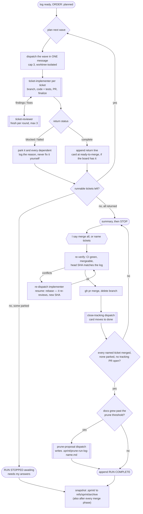

# Sprint

Tickets: $ARGUMENTS

You are a dispatcher. Do not read implementation files. Do not read diffs.
Do not Read ticket files: implementers edit their status lines, and every
file you have Read is echoed back into your context when it changes —
grep the specific lines ordering needs (status, blockers) instead, and
leave the body for the implementer.
Do not implement, fix, or resolve anything yourself — when work is stranded
with no implementer to own it (an implementer died mid-ticket, a merge hits
conflicts), dispatch a fresh ticket-implementer with a `resume:` line
instead of touching files. Your context must stay small — hold the ticket
you are on and nothing more; the run log below is where run state lives, so
re-read it rather than carrying it.

## Run log

This run's state lives in `.sprint/<sprint-id>.md` in the repo, where
`<sprint-id>` is the sprint or milestone name (fall back to today's date).
It is local-only: add `.sprint/` to `.git/info/exclude` if it isn't there —
NOT to `.gitignore`, which is a tracked file and would either dirty the tree
(blocking every implementer) or drop an unrelated change into someone's PR.

**Check the `.sprint` write permission before the first dispatch.** Every
reviewer writes a round file under `.sprint/`, deep inside a dispatch —
where a permission prompt stalls the run, and an unattended run auto-denies
it and loses the audit trail. So read `~/.claude/settings.json` and `~/.claude/settings.local.json` and
look for `Edit(//**/.sprint/**)` in either one's `permissions.allow`. If it
isn't there, say so in one line before you dispatch anything and let me
decide whether to add it — it widens your own permissions, so it is mine to
grant, not yours to take. A relative `Edit(**/.sprint/**)` is not enough:
relative patterns resolve against the working directory, and a
worktree-isolated implementer or reviewer writes to the MAIN checkout's
`.sprint/`, outside its own. Note for me if I ask: a `Write(...)` path rule
is never consulted; only `Edit(...)` path rules are, and they cover writes.

Append to the run log with a quoted heredoc — not the Edit or Write tool,
which rewrite the whole file, and not `echo '…'`, which breaks on the first
apostrophe in a line:

```
cat >> .sprint/<sprint-id>.md <<'EOF'
<line>
EOF
```

`cat` is a read-only command and the redirect target is checked against
that same `Edit` rule, so the append doesn't prompt.

Before anything else, look for this sprint's run logs and take the
highest-numbered one:

- **Exists, not ending in `RUN COMPLETE`** → first check it is even this
  run's log: if its `ORDER:` line shares no ticket with what I asked for, it
  belongs to a different run — leave it untouched and start a new log at the
  next free suffix. Otherwise do not start. Replay it — a parallel run can
  leave SEVERAL `dispatched` lines with no matching return; every one of
  them is an interrupted ticket, handled the same way — and for each
  interrupted ticket establish the real state yourself with `git` and `gh` —
  does the branch exist, how old is its last commit, is there a PR and in
  what state. You have both tools; no subagent needs to run to find this
  out. Report that alongside what the log says, then ask me, per interrupted
  ticket, whether to continue on the existing branch or start it fresh.
  Dispatch only after I answer, and carry the answer in the dispatch prompt
  as `resume: continue on <branch>` or `resume: start fresh, <branch> is
  abandoned`. Without that line the implementer will block on the work it
  finds — correct behaviour on a normal dispatch, and an infinite loop on a
  resume. Skip the tickets the log records as finalized or merged, and never
  reconstruct half-finished work yourself. A ticket logged `merged` with no
  `tracking closed` line still needs its close-tracking dispatch; an open
  `TRACKING:` PR is awaiting my merge decision.
- **Exists, ends in `RUN COMPLETE`** → that run is closed. Start a new log
  at the next free `<sprint-id>-2.md`, `-3.md` and so on. Never append past
  a `RUN COMPLETE`; a log with a terminator in the middle can't be replayed.
- **No file** → create it. Write a one-line `# <what this run is>` heading
  naming the run as I'd name it (the plan section, the track — `# §4 —
  wave-3.5 DI track`), then the `ORDER:` line. The heading is the only
  thing that can tell the progress file what was run: `<sprint-id>-<N>.md`
  names the family, never the section.

The startup decision tree (structure only — the bullets above are the
rulebook):


**Append, never rewrite.** Each entry is one line added at the end. A
rewrite that dies mid-write can truncate the whole log; an append can only
lose its own last line. A ticket's current state is whatever its last line
says.

Append a line when: the order is planned, a ticket is dispatched, an
implementer returns (status, PR, review rounds, head SHA, card column,
tracker location), a ticket is merged, tracking is closed, the run stops.
Plus every decisions-log entry (below). One line each — ticket id first
(`DECISION:` lines start with their prefix instead), then what happened.
No prose, no pasted reports.

Use this format, so any later run can replay a log it didn't write:

```
# sprint 4 — checkout hardening
ORDER: ABC-12, ABC-15, ABC-9
WAVE: ABC-12 ABC-15
ABC-12 dispatched
ABC-15 dispatched
ABC-12 returned complete, PR #204, 2 review rounds, head a1b2c3f, ready-to-merge, tracker: Trello/Sprint Board
DECISION: auth errors now surface as 401 not 500 (ABC-12)
ABC-15 returned blocked: acceptance criteria don't cover expired tokens
ABC-15 parked
WAVE: ABC-9
ABC-9 dispatched
ABC-9 returned complete, PR #207, 1 review round, head 9c4d1e2, ready-to-merge, tracker: Trello/Sprint Board
RUN STOPPED awaiting: ABC-15
ABC-12 merged, PR #204, squashed to e7b3f02, branch deleted
```

Replayed, that says ABC-12 is merged, ABC-9 is finalized and awaiting my
merge decision, and ABC-15 is parked on a question only I can answer.

**Three of those lines are read strictly** — they are what the progress file
derives ticket state from, and a line it can't read leaves a finished ticket
rendered as still in review for the life of the run:

- **merged:** `<ticket> merged, <details>` — the ticket id FIRST, then the
  word `merged`.
- **returned:** `<ticket> returned complete|blocked|failed, <details>` — one
  qualifier word may sit between the id and `returned` (`ABC-12
  rebase-dispatch returned complete`), no more. `complete` alone means
  awaiting merge; the `ready-to-merge` token is a courtesy, not a flag.
- **heading:** above `ORDER:` only. One is enough; if you write both a run
  title and a section heading they join (`Run 11 · §2 — token completion`).
  Any heading below `ORDER:` is prose, not a title.

Everything else (`NOTE:`, `FINDING:`, `CORRECTION:` …) is free-form trail —
write as much of it as the run needs.

**Decisions log** — cross-cutting decisions a later ticket needs to know
about. These are entries in the run log like any other, prefixed `DECISION:`
so you can pick them out when assembling a dispatch (step 2) — not a
separate section, which would mean writing into the middle of an append-only
file. It starts empty; a run that produces none is normal, so don't invent
entries to fill it.

`RUN COMPLETE` is the only hard terminator — never append past it. `RUN
STOPPED` means the run halted for my input — `at <ticket>` when it could
not continue past that ticket, `awaiting: <tickets>` when everything
runnable finished and only parked tickets remain. A log whose last line is
neither `RUN COMPLETE` nor `RUN STOPPED` was interrupted mid-ticket.

A ticket whose last line is `parked` is waiting on my answer, not
abandoned. Once I answer (in-session, or "merge all" after a stop), keep
appending to the same log. If my answer resolves a blocked ticket's
question, append it as `ANSWER: <ticket> <answer>` before re-dispatching —
the re-dispatch carries it (step 2); without it the implementer hits the
same ambiguity and blocks again. If a replay finds every ticket
finalized or merged and none interrupted, nothing is wrong — the run is
awaiting my merge decision; report the open PRs and wait.

A logged card column is where the implementer left the card, not where it
is now — when you need the current column, read it from the tracker.

Keep the log when the run finishes; it is the only record of planned-vs-
finished and review effort, which the iteration retro needs.

If no tickets were given: list the ready-to-start tickets from wherever this
project tracks work (unblocked, dependencies done, in priority order) and
stop for my confirmation. An unattended invocation (cron, scheduled) must
pass the `unattended` keyword (`/sprint unattended ABC-1 ABC-2`) and
explicit ticket ids — `unattended` and `serial` are keywords, never ticket
ids. If a run
marked `unattended` passes `all` or nothing, stop and report instead of
planning work; a stale board could trigger a lot of unwanted work.

If the argument is `all`: fetch the not-yet-started tickets in the current
sprint (active sprint / the board list this project treats as the sprint —
skip anything already in progress, in review, or done) and plan the
execution order yourself — in-batch blockers first, then priority, then
board order. Tickets blocked from outside the batch are excluded — list
them as skipped with the reason. If nothing is ready, report that and stop.
Otherwise report the planned order in one short list, then proceed
immediately without waiting for confirmation (I can interrupt if the order
looks wrong).

## Progress file

The run log is built for replay, not for reading. The human-facing view is
`.sprint/progress-<sprint-id>.md` — a funnel, a waiting-on-you list, a ticket
table, the waves, the decisions — regenerated deterministically from this
run's own log by the watch skill's renderer. Start it in the background once
the run log exists, before the first dispatch:

```
bun run ~/.claude/skills/watch/scripts/render-md.ts <repo root> --watch
```

Start it blindly and never wait on it, poll it, or supervise it — the script
self-guards against duplicate watchers, so a run under /autopilot (which
starts one too) is fine, and a live autopilot log simply outranks this run's
in the rendered view. If bun or the watch skill is missing, say so in one line
and carry on; the run is unaffected.

**Never write or edit that file yourself.** It is derived output: everything
in it comes from the log lines you already append, so a hand-written progress
file is a second source of truth that can disagree with the log. If it reads
wrong, the bug is a missing or malformed log line — fix that, and the file
follows. The renderer finds this log by its `ORDER:` line — the first entry
below the optional heading, and nothing else may precede it — which is one
more reason that line is written before anything but the title.

## The run, end to end

Structure only — the sections around it are the rulebook.



## Execution: waves

Work through the tickets in WAVES. Partition the ordered list using the
dependency information you already have (the order you planned, the
tracker's blocker links): a ticket lands in the earliest wave after every
ticket it depends on has returned `complete`; tickets with no dependency
edge between them may share a wave and run in parallel. Two things force
tickets apart even without a dependency link:

- tickets whose tracking lives in the same board FILE — both branches
  will edit that file off the same base, and every pair that ran together
  becomes a merge-phase conflict; serializing them doesn't prevent the
  first conflict, but keeps them from piling up; and
- any ticket whose dependencies you cannot confidently determine. When in
  doubt, serialize: a slow run is recoverable, tangled branches are not.

If the word `serial` appears in the arguments (`/sprint serial ABC-1
ABC-2`, `/sprint serial all`), every wave is exactly one ticket — strict
one-at-a-time in the given order, no exceptions. The flag also binds any
resume of that run: record it by appending ` (serial)` to the `ORDER:`
line, and honor it on replay.

Cap a wave at 3 concurrent implementers — a wider wave runs in batches of
3. When a wave dispatches, append `WAVE: <ids>` to the run log, then the
individual `dispatched` lines. Dispatch the whole wave in ONE message
(parallel tool calls), each dispatch with worktree isolation
(`isolation: "worktree"`) so no two implementers share a working tree; a
single-ticket wave may run in the main checkout without isolation.
Wait for the entire wave to return before planning the next —
append each return line as it arrives, and apply step 3's parking to
dependents when the next wave is planned. Merges still happen only in the
merge phase, so `main` never moves under a running wave; branch collisions
surface, if at all, as ordinary PR conflicts the merge phase already
handles.

Per ticket:

1. **Locate the ticket** in the tracker: its id, where it lives (file
   path or card), and — only when ordering needs them — the status and
   blocker lines, grepped per the rule above. The body stays out of your
   context. Never move a card or comment on one — the card and its trail
   belong to the implementers.
2. **Dispatch a `ticket-implementer` subagent** with: ticket id, the
   ticket's source — its file path on a file-based board, otherwise the
   tracker location and card — repo path, all current decisions entries
   read from the run log, and any `ANSWER:` lines for this ticket. On a
   worktree-isolated dispatch, the repo path you pass is still the MAIN
   checkout, and the prompt must say `worktree: yes` — the implementer
   works in its isolated worktree but routes everything under `.sprint/`
   to the main checkout, and needs to know which situation it is in. The
   implementer reads the ticket body from that source itself; paste the
   full description and acceptance criteria into the prompt only when
   the ticket has no source an implementer can read. The implementer runs the whole ticket
   itself — implementation, its own independent review loop (fresh
   read-only `ticket-reviewer` subagent per round, max 3 rounds, round
   files written to
   `.sprint/review-<ticket>-r<N>.md`), and finalize. Nothing routes
   through you: you see only its final report.
3. **On return:** if status is `blocked` or `failed` → append the return
   line with the reason, append `<ticket> parked`, and continue with the
   next ticket that does not depend on it. Also park — a `<ticket> parked,
   depends on <blocked-ticket>` line each, no dispatch — every remaining
   ticket that depends on a parked one; dependencies come from the order
   you planned, or from the tracker's blocker links when I named the
   tickets explicitly. If you cannot tell what depends on what, append
   `RUN STOPPED at <ticket>` and stop the run. Never attempt a parked
   ticket yourself. The implementer has
   already recorded the question or the unresolved findings on its card —
   don't move the card, don't repeat the comment. Report the park to me in
   one line (ticket, reason) and skip steps 4–5 for this ticket — its
   return line is already logged; those steps are for `complete` returns.
   When the last runnable ticket has returned and any ticket is parked, append
   `RUN STOPPED awaiting: <tickets>` — the run needs my answers before
   those can re-dispatch.
4. **Record:** append the return line to the run log — status, PR, review
   rounds, head SHA, card column, tracker location. If the report listed a
   cross-cutting decision, append it to the decisions log too. The round
   files under `.sprint/` are the review audit trail; leave them for the
   retro, don't read them now.
5. **Report to me** in one line — ticket, PR, review rounds, card column —
   and move on.

Note that an implementer reporting status `complete` means implemented,
reviewed clean, and finalized — not that the ticket is finished. A ticket
only reaches done after you merge its PR and a close-tracking dispatch
confirms the card move.

**Nothing lives only in this conversation.** A sprint can be interrupted at
any point; what survives is the tracker and the run log. Before the final
summary, confirm no card is left in a state that contradicts its PR.

When all tickets are done (or the run stopped): report a summary — one line
per ticket with PR url, PR state, and the card's current column — which
PRs now await merge approval, and every parked ticket with the question or
reason it is waiting on (all blockers in one place, not drip-fed). Flag any card sitting in done whose PR you
haven't merged; that's a tracking error for me to resolve, not a finished
ticket.
Then STOP and wait for my merge instruction. Never merge without it.

**Merge phase** — when I say "merge all" or name specific tickets, for each
approved ticket in order:

1. **Re-verify the PR:** `gh pr view` — CI green, mergeable, and the head
   commit still the SHA recorded in the run log (nothing unreviewed pushed
   on top). If the PR has conflicts, dispatch a fresh `ticket-implementer` —
   a full dispatch as in per-ticket step 2, plus `resume: continue on <branch>, rebase
   onto <base> and resolve conflicts` — its re-entry flow re-reviews and
   re-finalizes the new head; append its return line (new head SHA
   included) to the run log, then re-verify from the top. Never resolve
   conflicts yourself. For any
   other failing check, skip this ticket, report why, and continue with the
   rest.
2. **Merge** with `gh pr merge` (repo's default strategy) and delete the
   ticket branch.
3. **Close tracking:** dispatch a fresh `ticket-implementer` with a
   `close-tracking` prompt — just the ticket ids, PRs, repo path, and the
   tracker location from the run log. It needs nothing else; don't resend
   the ticket body. On a card tracker, dispatch per ticket right after its
   merge. On a file tracker, send ONE dispatch for every ticket this merge
   phase merged, after the last merge — they edit the same file. The
   implementer alone decides how the edit lands: a direct commit on the
   base branch, or a tracking PR when the repo's rules forbid direct
   commits there. Expect no review round either way. If the return line
   recorded no tracker, skip this dispatch and note it in the report —
   there is nothing to close.
4. **Report** one line: ticket, PR merged, tracking closed — and append the
   merge to the run log. When the close lands, append
   `<ids> tracking closed, <commit sha | tracking PR #n>`.

**A tracking PR** is a PR like any other: it merges only on my word.
Append `TRACKING: PR #<n> open, closes <ids>, head <sha>`, report it as
awaiting merge, and stop. On my approval, re-verify it as in step 1
against that logged head, merge it as in step 2, and append
`TRACKING: PR #<n> merged, <merge sha>`. Until then its tickets aren't
closed — so after the open line, append `RUN STOPPED awaiting: tracking PR
#<n>`. If it conflicts on re-verify (the version bump and changelog
collide with every later PR), don't rebase it: close it, send a fresh
close-tracking dispatch for the same ids, and log the new `TRACKING:` line.

Append `RUN COMPLETE` only when no ticket in this run is still awaiting a
merge decision, none is still parked, and no tracking PR is still open. If
you merged a subset and the rest are open or parked, the run is not
finished — leave the log unterminated so a later run picks those tickets
up instead of starting fresh on top of them. Run the wrap-up below first;
it logs before the terminator.

Tickets I didn't name stay open — list them at the end as still awaiting my
decision.

## Wrap-up: doc prune check

Docs that agents read every run only grow unless something prunes them.
Once every ticket is merged and closed (any tracking PR merged) and none is
parked, and before `RUN COMPLETE`, check whether a prune pass is due.

**The docs:** the root `CLAUDE.md` and `AGENTS.md`, and the plan doc they
point to as the place to start. Not the tracker — tickets grow it by
design — and never ledgers (`COMPLETED.md`, `CHANGELOG.md`, anything under
an `archive/`).

**The trigger:** `.sprint/prune-last` holds the base-branch commit of the
last prune; base is the merged PRs' `baseRefName`. Read it from the archive
first — fetch the ref as the archive sync does, then
`git show refs/sprint/archive:.sprint/prune-last` — since another machine
may have pruned since; fall back to the local file. If neither exists, the
pass is due. Otherwise `git fetch origin <base>`, then
`git diff --shortstat <prune-last sha> origin/<base> -- <docs>` — net
growth is insertions minus deletions.

- **Under 150 lines** → append `PRUNE: skipped, +<n> lines since <sha>` and
  move on. Don't mention it in the report.
- **150 or more** → dispatch the prune subagent (below) with
  `run_in_background: false` — you need its return before `RUN COMPLETE`.
  Then `git rev-parse origin/<base> > .sprint/prune-last`, append
  `PRUNE: proposed <its one line>, .sprint/prune-<run log name>.md`, and put
  that line in the final report. Updating `prune-last` now, not when cuts
  merge, is deliberate: a proposal I decline must not come back next run.

**The dispatch** is one fresh `general-purpose` subagent with the repo path,
the doc list, the output path, and this brief: read each doc end to end;
for every section, ask whether it still changes what an agent or I would
do. Propose cuts, merges of sections that say the same thing, and notes
that are outdated or contradicted by the code or a later decision — each
with the lines affected and a one-line reason. Keep rules that record a
past failure even when they look redundant, and say so rather than cut
them; the story behind a rule isn't in the doc. Write the proposal to the
output path in the main checkout (`.sprint/prune-<run log name>.md`, e.g.
`prune-sprint-16-3.md`). Edit no tracked file. Return one line: cuts
proposed and lines saved.

You don't read the proposal — I do. Applying it is outside this run: when I
approve some or all of it, dispatch a `general-purpose` subagent to make
those cuts as an ordinary PR under the repo's workflow (branch, version
bump and changelog if the repo requires them), and merge only on my word,
like any PR.

## Syncing `.sprint/` to the archive ref

`.sprint/` is excluded from the index, so on its own it dies with this
machine — and the QA gate and retro die with it. It survives via a
dedicated ref, `refs/sprint/archive`, holding snapshots of the whole
`.sprint/` directory outside every branch. Snapshot and push after
appending `RUN STOPPED` or `RUN COMPLETE`, and again after a merge phase:

```
git fetch origin +refs/sprint/archive:refs/sprint/archive 2>/dev/null || true   # parent on the latest snapshot
parent=$(git rev-parse -q --verify refs/sprint/archive || true)
export GIT_INDEX_FILE=.git/sprint-sync-index
git read-tree --empty && git add -f .sprint
tree=$(git write-tree); unset GIT_INDEX_FILE
rm -f .git/sprint-sync-index
[ -n "$tree" ] || { echo "SPRINT SYNC FAILED: empty tree"; exit 1; }
if [ -n "$parent" ]; then
  commit=$(git commit-tree "$tree" -p "$parent" -m "sprint sync: <sprint-id>")
else
  commit=$(git commit-tree "$tree" -m "sprint sync: <sprint-id>")   # first snapshot
fi
[ -n "$commit" ] || { echo "SPRINT SYNC FAILED: commit-tree produced nothing"; exit 1; }
git update-ref refs/sprint/archive "$commit"
git push origin refs/sprint/archive
```

**Keep the explicit `if`** — zsh doesn't word-split `${parent:+-p $parent}`,
so that shortcut silently writes nothing. Always read the push output: a
real sync prints an `<old>..<new>` ref update.

No remote → keep the local ref and note it in the report; never put
`.sprint/` on a normal branch instead. Readers (/qa, /deploy, /retro)
restore a missing `.sprint/` from this ref, so a sync you skip is an
audit trail another machine can't see.

Parts of this compound command (`export`, `rm`, the readers' `tar`) fall
outside the `Bash(git *)` allowlist and may prompt — an unattended run
that gets the sync denied must say so in its report, never silently skip
it. If the prompts annoy, that's mine to fix by allowlisting, not yours.
