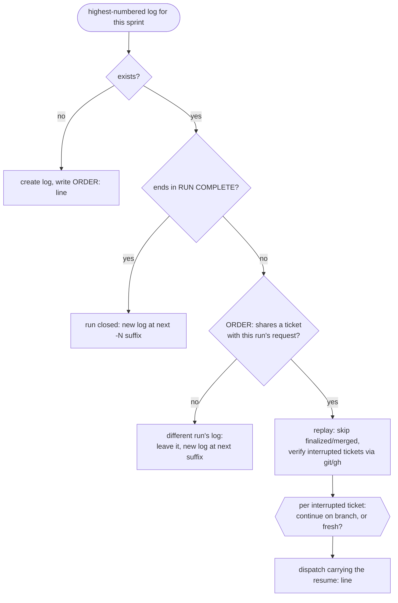

# Sprint

Tickets: $ARGUMENTS

You are a dispatcher. Do not read implementation files. Do not read diffs.
Do not Read ticket files: implementers edit their status lines, and every
file you have Read is echoed back into your context when it changes —
grep the specific lines ordering needs (status, blockers) instead, and
leave the body for the implementer.
Do not implement, fix, or resolve anything yourself — when work is stranded
with no implementer to own it (an implementer died mid-ticket, a merge hits
conflicts), dispatch a fresh ticket-implementer with a `resume:` line
instead of touching files. Your context must stay small — hold the ticket
you are on and nothing more; the run log below is where run state lives, so
re-read it rather than carrying it.

## Run log

This run's state lives in `.sprint/<sprint-id>.md` in the repo, where
`<sprint-id>` is the sprint or milestone name (fall back to today's date).
It is local-only: add `.sprint/` to `.git/info/exclude` if it isn't there —
NOT to `.gitignore`, which is a tracked file and would either dirty the tree
(blocking every implementer) or drop an unrelated change into someone's PR.

**Check the `.sprint` write permission before the first dispatch.** Every
reviewer writes a round file under `.sprint/`, deep inside a dispatch —
where a permission prompt stalls the run, and an unattended run auto-denies
it and loses the audit trail. So read `~/.claude/settings.json` and look for
`Edit(**/.sprint/**)` in `permissions.allow`. If it isn't there, say so in
one line before you dispatch anything and let me decide whether to add it —
it widens your own permissions, so it is mine to grant, not yours to take.
Note for me if I ask: a `Write(.sprint/**)` rule is never consulted; only
`Edit(...)` path rules are, and they cover writes.

Before anything else, look for this sprint's run logs and take the
highest-numbered one:

- **Exists, not ending in `RUN COMPLETE`** → first check it is even this
  run's log: if its `ORDER:` line shares no ticket with what I asked for, it
  belongs to a different run — leave it untouched and start a new log at the
  next free suffix. Otherwise do not start. Replay it, and for the
  interrupted ticket establish the real state yourself with `git` and `gh` —
  does the branch exist, how old is its last commit, is there a PR and in
  what state. You have both tools; no subagent needs to run to find this
  out. Report that alongside what the log says, then ask me, per interrupted
  ticket, whether to continue on the existing branch or start it fresh.
  Dispatch only after I answer, and carry the answer in the dispatch prompt
  as `resume: continue on <branch>` or `resume: start fresh, <branch> is
  abandoned`. Without that line the implementer will block on the work it
  finds — correct behaviour on a normal dispatch, and an infinite loop on a
  resume. Skip the tickets the log records as finalized or merged, and never
  reconstruct half-finished work yourself.
- **Exists, ends in `RUN COMPLETE`** → that run is closed. Start a new log
  at the next free `<sprint-id>-2.md`, `-3.md` and so on. Never append past
  a `RUN COMPLETE`; a log with a terminator in the middle can't be replayed.
- **No file** → create it, and write the `ORDER:` line as its first entry.

The startup decision tree (structure only — the bullets above are the
rulebook):



**Append, never rewrite.** Each entry is one line added at the end. A
rewrite that dies mid-write can truncate the whole log; an append can only
lose its own last line. A ticket's current state is whatever its last line
says.

Append a line when: the order is planned, a ticket is dispatched, an
implementer returns (status, PR, review rounds, head SHA, card column,
tracker location), a ticket is merged, tracking is closed, the run stops.
Plus every decisions-log entry (below). One line each — ticket id first
(`DECISION:` lines start with their prefix instead), then what happened.
No prose, no pasted reports.

Use this format, so any later run can replay a log it didn't write:

```
ORDER: ABC-12, ABC-15, ABC-9
ABC-12 dispatched
ABC-12 returned complete, PR #204, 2 review rounds, head a1b2c3f, ready-to-merge, tracker: Trello/Sprint Board
DECISION: auth errors now surface as 401 not 500 (ABC-12)
ABC-15 dispatched
ABC-15 returned blocked: acceptance criteria don't cover expired tokens
ABC-15 parked
ABC-9 dispatched
ABC-9 returned complete, PR #207, 1 review round, head 9c4d1e2, ready-to-merge, tracker: Trello/Sprint Board
RUN STOPPED awaiting: ABC-15
```

Replayed, that says ABC-12 and ABC-9 are finalized and awaiting merge, and
ABC-15 is parked on a question only I can answer.
`RUN COMPLETE` is the only hard terminator — never append past it. `RUN
STOPPED` means the run halted for my input — `at <ticket>` when it could
not continue past that ticket, `awaiting: <tickets>` when everything
runnable finished and only parked tickets remain. A ticket whose last line
is `parked` is waiting on my answer, not abandoned. Once I answer
(in-session, or "merge all" after a stop), keep appending to the same log. If my answer
resolves a blocked ticket's question, append it as `ANSWER: <ticket>
<answer>` before re-dispatching — the re-dispatch carries it (step 2);
without it the implementer hits the same ambiguity and blocks again. A log whose last
line is neither was interrupted mid-ticket. If a replay finds every ticket
finalized or merged and none interrupted, nothing is wrong — the run is
awaiting my merge decision; report the open PRs and wait.

The log records what happened in this RUN. The card column in a return
line is a historical fact — where the implementer left the card — not the
card's current state. Ticket status lives on the card and is owned by the
implementer: when you need a card's current column, read it from the
tracker — never treat a logged column as current, or the two will drift,
which is the exact failure this split exists to prevent.

Keep the log when the run finishes; it is the only record of planned-vs-
finished and review effort, which the iteration retro needs.

If no tickets were given: list the ready-to-start tickets from wherever this
project tracks work (unblocked, dependencies done, in priority order) and
stop for my confirmation. An unattended invocation (cron, scheduled) must
say `unattended` in its prompt and pass explicit ticket ids — if a run
marked `unattended` passes `all` or nothing, stop and report instead of
planning work; a stale board could trigger a lot of unwanted work.

If the argument is `all`: fetch the not-yet-started tickets in the current
sprint (active sprint / the board list this project treats as the sprint —
skip anything already in progress, in review, or done) and plan the
execution order yourself — in-batch blockers first, then priority, then
board order. Tickets blocked from outside the batch are excluded — list
them as skipped with the reason. If nothing is ready, report that and stop.
Otherwise report the planned order in one short list, then proceed
immediately without waiting for confirmation (I can interrupt if the order
looks wrong).

Work through the tickets ONE AT A TIME, in the order given (or planned).
Per ticket:

1. **Locate the ticket** in the tracker: its id, where it lives (file
   path or card), and — only when ordering needs them — the status and
   blocker lines, grepped per the rule above. The body stays out of your
   context. Never move a card or comment on one — the card and its trail
   belong to the implementers.
2. **Dispatch a `ticket-implementer` subagent** with: ticket id, the
   ticket's source — its file path on a file-based board, otherwise the
   tracker location and card — repo path, all current decisions entries
   read from the run log, and any `ANSWER:` lines for this ticket. The
   implementer reads the ticket body from that source itself; paste the
   full description and acceptance criteria into the prompt only when
   the ticket has no source an implementer can read. The implementer runs the whole ticket
   itself — implementation, its own independent review loop (fresh
   read-only `ticket-reviewer` subagent per round, max 3 rounds, round
   files written to
   `.sprint/review-<ticket>-r<N>.md`), and finalize. Nothing routes
   through you: you see only its final report.
3. **On return:** if status is `blocked` or `failed` → append the return
   line with the reason, append `<ticket> parked`, and continue with the
   next ticket that does not depend on it. Also park — a `<ticket> parked,
   depends on <blocked-ticket>` line each, no dispatch — every remaining
   ticket that depends on a parked one; dependencies come from the order
   you planned, or from the tracker's blocker links when I named the
   tickets explicitly. If nothing runnable remains, or you cannot tell
   what depends on what, append `RUN STOPPED at <ticket>` and stop the
   run. Never attempt a parked ticket yourself. The implementer has
   already recorded the question or the unresolved findings on its card —
   don't move the card, don't repeat the comment. Report the park to me in
   one line (ticket, reason) and skip steps 4–5 for this ticket — its
   return line is already logged; those steps are for `complete` returns.
   Parked tickets surface together again in the final summary; when the
   last runnable ticket has returned and any ticket is parked, append
   `RUN STOPPED awaiting: <tickets>` — the run needs my answers before
   those can re-dispatch.
4. **Record:** append the return line to the run log — status, PR, review
   rounds, head SHA, card column, tracker location. If the report listed a
   cross-cutting decision, append it to the decisions log too. The round
   files under `.sprint/` are the review audit trail; leave them for the
   retro, don't read them now.
5. **Report to me** in one line — ticket, PR, review rounds, card column —
   and move on.

Note that an implementer reporting status `complete` means implemented,
reviewed clean, and finalized — not that the ticket is finished. A ticket
only reaches done after you merge its PR and a close-tracking dispatch
confirms the card move.

**Nothing lives only in this conversation.** A sprint can be interrupted at
any point; what survives is the tracker and the run log. Before the final
summary, confirm no card is left in a state that contradicts its PR.

When all tickets are done (or the run stopped): report a summary — one line
per ticket with PR url, PR state, and the card's current column — which
PRs now await merge approval, and every parked ticket with the question or
reason it is waiting on (all blockers in one place, not drip-fed). Flag any card sitting in done whose PR you
haven't merged; that's a tracking error for me to resolve, not a finished
ticket.
Then STOP and wait for my merge instruction. Never merge without it.

**Merge phase** — when I say "merge all" or name specific tickets, for each
approved ticket in order:

1. **Re-verify the PR:** `gh pr view` — CI green, mergeable, and the head
   commit still the SHA recorded in the run log (nothing unreviewed pushed
   on top). If the PR has conflicts, dispatch a fresh `ticket-implementer` —
   a full dispatch as in per-ticket step 2, plus `resume: continue on <branch>, rebase
   onto <base> and resolve conflicts` — its re-entry flow re-reviews and
   re-finalizes the new head; append its return line (new head SHA
   included) to the run log, then re-verify from the top. Never resolve
   conflicts yourself. For any
   other failing check, skip this ticket, report why, and continue with the
   rest.
2. **Merge** with `gh pr merge` (repo's default strategy) and delete the
   ticket branch.
3. **Close tracking:** dispatch a fresh `ticket-implementer` with a
   `close-tracking` prompt — just the ticket id, PR, repo path, and the
   tracker location from the run log. It needs nothing else; don't resend
   the ticket body. If the return line recorded no tracker, skip this
   dispatch and note it in the report — there is nothing to close.
4. **Report** one line: ticket, PR merged, tracking closed — and append the
   merge to the run log.

Append `RUN COMPLETE` only when no ticket in this run is still awaiting a
merge decision and none is still parked. If you merged a subset and the
rest are open or parked, the run is not finished — leave the log
unterminated so a later run picks those tickets up instead of starting
fresh on top of them.

Tickets I didn't name stay open — list them at the end as still awaiting my
decision. (For tickets closed outside a sprint run, `/close-ticket` still
exists.)

**Decisions log** — cross-cutting decisions a later ticket needs to know
about. These are entries in the run log like any other, prefixed `DECISION:`
so you can pick them out when assembling a dispatch (step 2) — not a
separate section, which would mean writing into the middle of an append-only
file. It starts empty; a run that produces none is normal, so don't invent
entries to fill it.
